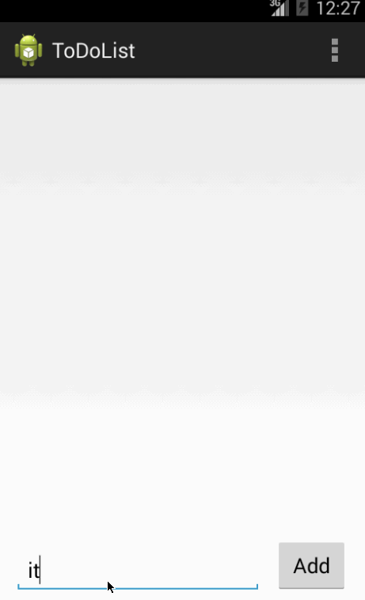

ToDoList
=========

This application is ToDoList for Android Bootcamp class. Below are list of Topics are used for this application

  - Layout: relative layout
  - Views
  - Activities (GUI)
  - TextView
  - EditText
  - Button
  - ListView
  - File

Time spent: 6 hours

Completed User Stories:

  - [x] Required: User can add Item into ListView
  - [x] Required: User can remove item from ListView
  - [x] Required: User can save data on ListView into file
  - [x] Required: User can edit data on ListView by opening another activity and send edited data back to same position of item list
 
Notes:

I spent about 2 hours for first 3 checklist. In addition, I spent the rest of hour to figure out how to get position that user selected and edit with a new value. Finally, I have 2 ideas to get it and one of them is used in this application.

Getting position on selected ListView:
 
 - Creating a global variable to store position on "onItemClick"
 - Creating another ".putExtra()" to send and receive it back from edit page 
 
Walkthrough of all users stories:

GIF created with [LiceCap]

[LiceCap]:www.cockos.com/licecap/
